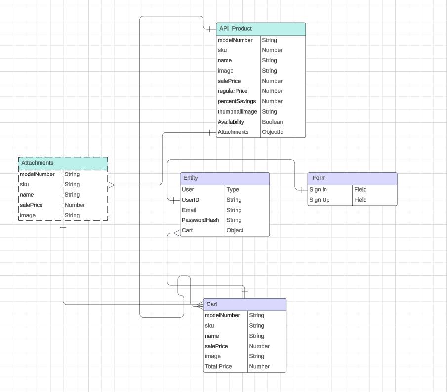
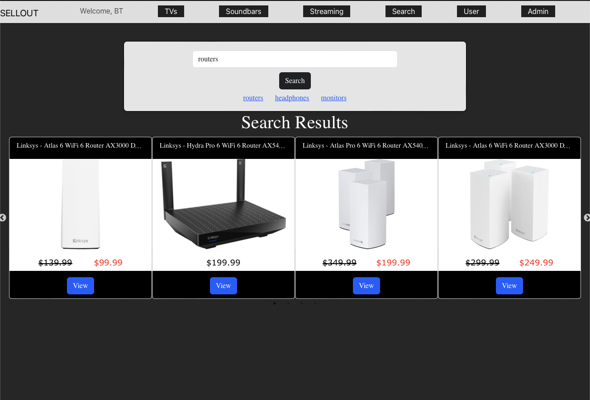
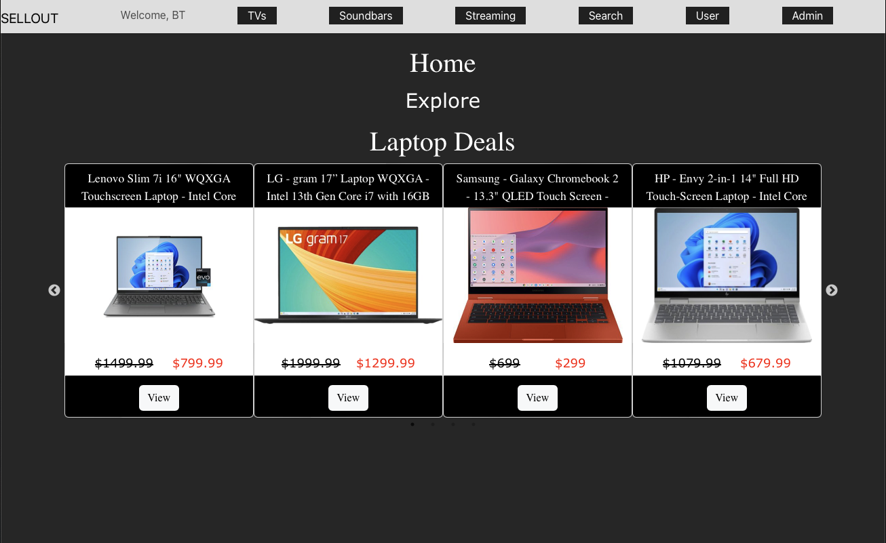
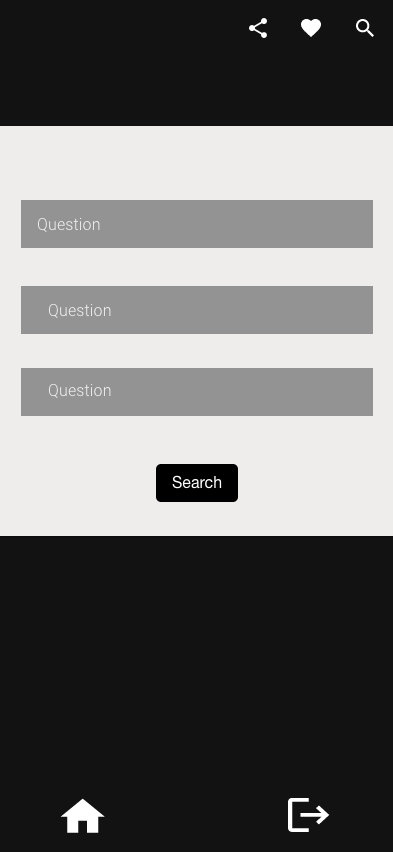
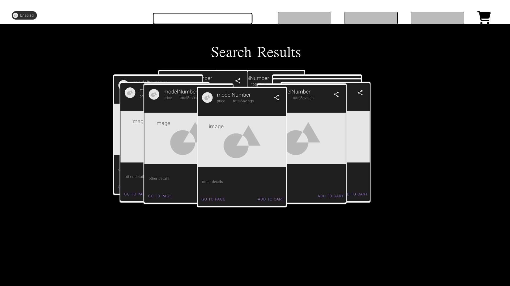
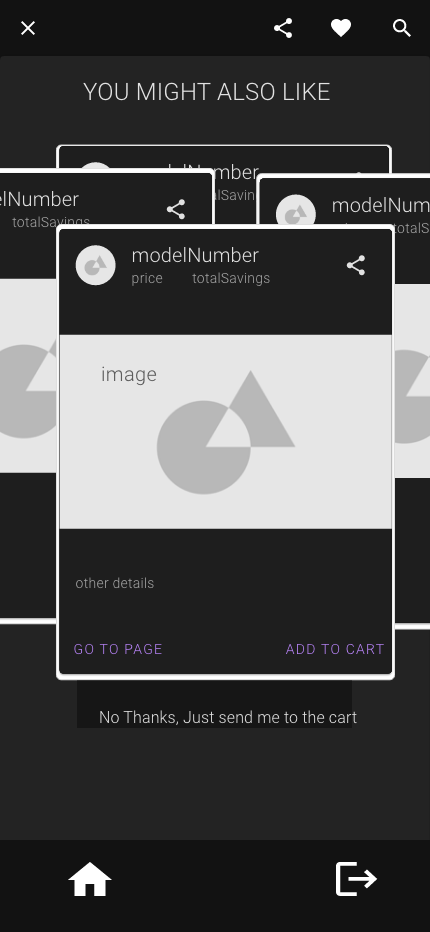
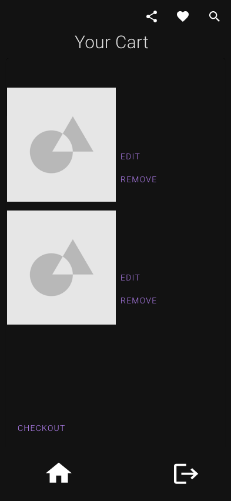

# SellOut (Mock Products App)

### **Description**

**SellOut** is a full-stack web application designed to simulate an online marketplace for electronics, leveraging Best Buy's API. Built with the MERN stack (MongoDB, Express, React, Node.js), it features authentication, CRUD operations, advanced product search and filtering, and a shopping cart system.

### **Technologies Used**

**Frontend:** React.js, Bootstrap/Material-UI for styling

**Backend:** Node.js with Express.js

**Database:** MongoDB
Authentication: 

**APIs:** 
Best Buy's API for product data

### **Features**

- User authentication (signup/login)
- Advanced search and filtering capabilities
- Product browsing and detailed view
- Add to cart and manage cart items
- Product recommendations
- Review and rating system for products

### User Stories

- *As a user, I want to sign up and log in, so that I can have a personalized shopping experience.*
- *As a user, I want to search for TVs and laptops, so that I can find products that meet my needs.*
- *As a user, I want to filter search results by specific criteria (e.g., brand, price range), so that I can narrow down the options.*
- *As a user, I want to view detailed information about a product, so that I can make an informed decision before purchasing.*
- *As a user, I want to add products to my cart, view my cart, and have the ability to edit and remove items.*
- *As a user, I want to add accessories to my purchases, so that I can get all the necessary products at once.*

## WIREFRAMES

### Navbar with dropdown log in.
  

### Home page to display latest deals

### Search Filter 

### Search Results 

### Attachments 
After adding items to card, users will be redirected to recommended attachments.

### Cart
After Adding items to cart, users will have the option to remove items, and edit cart.

